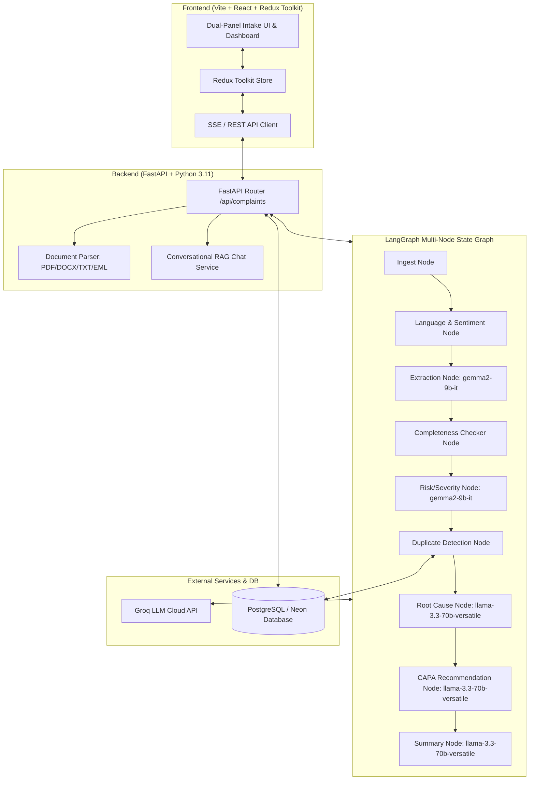

# AI-Powered Customer Complaint Management System (Pharma QMS)

[](https://github.com/sabatsambit49-dot/AI-Powered-Customer-Complaint-Management-System-/actions)
[](https://opensource.org/licenses/MIT)

> **Live Demo Links:**
> - 🌐 **Frontend (Vercel)**: `https://pharma-qms-complaints.vercel.app` *(Deploy Link Placeholder)*
> - ⚡ **Backend API (Render)**: `https://pharma-qms-backend.onrender.com/api/health` *(Deploy Link Placeholder)*
> - 📹 **Demo Videos**: [Video 1: Walkthrough](https://youtube.com) | [Video 2: Technical Deep Dive](https://youtube.com)

---

## 1. Project Overview & Problem Statement

In pharmaceutical manufacturing—spanning both Active Pharmaceutical Ingredients (API) and Finished Dosage Forms (FDF)—customer complaints serve as critical signals of potential quality deviations, batch sterility breaches, container closure integrity failures, or labeling errors. Regulatory authorities (FDA 21 CFR Part 211.198, EU GMP Chapter 8) mandate rigorous intake, investigation, root cause analysis, and Corrective and Preventive Action (CAPA) tracking for every quality event.

Traditional complaint intake relies on manual data entry from emails, PDFs, or physical incident forms. This creates bottlenecking, inconsistent severity classification, delayed risk escalation, and missed duplicate reports across manufacturing lots. 

The **AI-Powered Customer Complaint Management System** automates this end-to-end workflow. Using a multi-node **LangGraph** state graph orchestrated via **Groq LLM APIs**, the system ingests unstructured complaint documents (PDF, DOCX, TXT, EML), streams real-time field extraction into a dual-panel QA form, performs pharma-specific risk triage (Critical/Major/Minor), scans historical PostgreSQL database records for duplicate batch incidents, and auto-generates preliminary Root Cause and CAPA recommendations for QA reviewers.

---

## 2. System Architecture



---

## 3. Tech Stack

- **Frontend**: React 18, Redux Toolkit 2.2, Vite 5, Tailwind CSS 3.4, Lucide React Icons, Google "Inter" Font.
- **Backend**: Python 3.11, FastAPI 0.110, Uvicorn, Pydantic v2, SSE-Starlette.
- **AI Agent Orchestration**: LangGraph 0.0.30, LangChain Core.
- **LLM Provider**: Groq API (`gemma2-9b-it` for fast extraction/classification; `llama-3.3-70b-versatile` for root cause, CAPA, & summary).
- **Database & ORM**: PostgreSQL 15 (or Neon Serverless Postgres), SQLAlchemy 2.0, Alembic 1.13.
- **Document Parsing**: `pypdf`, `python-docx`, Python standard `email` package.
- **DevOps & Containerization**: Docker, Docker Compose, GitHub Actions CI/CD.

---

## 4. LangGraph Multi-Node Pipeline Explanation

1. **Ingest Node**: Receives uploaded files (PDF/DOCX/TXT/EML) or raw text and extracts clean plain-text strings while handling decoding fallbacks.
2. **Language & Sentiment Node**: Detects complaint input language, translates non-English complaints to English, and assesses sentiment/urgency.
3. **Extraction Node (`gemma2-9b-it`)**: Parses raw text using structured JSON schema extraction into 12 distinct pharma fields (Product Name, Batch Number, Customer, Expiry, Qty, Defect Type, etc.).
4. **Completeness Checker Node**: Evaluates mandatory fields, calculates a 0-100% completeness score, and flags missing fields with suggested clarifying questions for the customer.
5. **Risk & Severity Classification Node (`gemma2-9b-it`)**: Classifies `initial_severity` (Critical/Major/Minor), `priority` (High/Medium/Low), and evaluates advisory regulatory escalation (e.g. Field Alert Report / FAR).
6. **Duplicate Detection Node**: Queries PostgreSQL database for existing complaint records matching the same batch lot number or product description to flag recurring lot defects.
7. **Root Cause Recommendation Node (`llama-3.3-70b-versatile`)**: Recommends cGMP root cause categories (Manufacturing Deviation, Packaging Line Error, Cold Chain Excursion, Sub-potency) with technical reasoning.
8. **CAPA Recommendation Node (`llama-3.3-70b-versatile`)**: Drafts formal 3-step Corrective and Preventive Actions (Immediate Containment, Corrective, Preventive).
9. **Summary Node (`llama-3.3-70b-versatile`)**: Generates a concise executive QA review summary for management dashboards.

---

## 5. Local Setup & Installation

### Prerequisites
- Docker & Docker Compose
- Node.js 18+ & npm
- Python 3.11+
- Groq API Key (from [console.groq.com](https://console.groq.com))

### 1. Clone & Environment Configuration
```bash
git clone https://github.com/sabatsambit49-dot/AI-Powered-Customer-Complaint-Management-System-.git
cd AI-Powered-Customer-Complaint-Management-System-
```
Copy `.env.example` to `backend/.env`:
```bash
cp .env.example backend/.env
```
Edit `backend/.env` and add your `GROQ_API_KEY`:
```env
GROQ_API_KEY=gsk_...
PRIMARY_MODEL=gemma2-9b-it
REASONING_MODEL=llama-3.3-70b-versatile
DATABASE_URL=sqlite:///./pharma_complaints.db
```

### 2. Run Database via Docker
```bash
docker-compose up postgres -d
```

### 3. Backend Setup
```bash
cd backend
python -m venv venv
# On Windows:
venv\Scripts\activate
# On Linux/macOS:
source venv/bin/activate

pip install -r requirements.txt
uvicorn app.main:app --reload --port 8000
```

### 4. Frontend Setup
In a new terminal:
```bash
cd frontend
npm install
npm run dev
```
Open `http://localhost:5173` in your browser.

---

## 6. API Reference

### Health Check
- `GET /api/health`
  - Returns `{"status": "healthy", "service": "Pharma QMS Customer Complaint Management API"}`

### Document Field Extraction (Sync & Stream)
- `POST /api/complaints/extract` (Multipart Form: `file`, `raw_text`)
- `POST /api/complaints/stream-extract` (SSE Real-time progress stream)

### Complaints CRUD
- `POST /api/complaints`: Save complaint to database.
- `GET /api/complaints?severity=Critical&search=CFT-9082`: List complaints with filtering.
- `GET /api/complaints/{id}`: Fetch single complaint record.

### AI RAG Chat Assistant
- `POST /api/complaints/{id}/chat` or `POST /api/complaints/chat-draft`: Query AI assistant regarding loaded complaint.

---

## 7. Deployment Instructions

- **Frontend (Vercel)**: Connect repo root `/frontend`, Framework preset: Vite, set env `VITE_API_BASE_URL=https://your-backend.onrender.com`.
- **Backend (Render)**: Connect repo root `/backend`, Build command `pip install -r requirements.txt`, Start command `uvicorn app.main:app --host 0.0.0.0 --port 8000`.
- **Database (Neon Postgres)**: Create free Neon project, set `DATABASE_URL` in Render environment variables.
- *Note on Render free tier*: The service spins down after 15 minutes of inactivity and takes 30-50 seconds to cold start on the first request.

---

## 8. Known Limitations & Future Enhancements

- **No Production OCR**: Scanning scanned images/photos requires OCR engine integration (e.g. Tesseract / AWS Textract).
- **Groq Free-Tier Rate Limits**: TPM/RPM rate limits apply on free tier; handled via exponential backoff retries.
- **Future Enhancements**: Vector similarity embeddings via Pgvector for deep semantic duplicate detection, ERP/SAP integration hooks.

---

## 9. License & Assignment Note

Distributed under the **MIT License**.

*Built for AIVOA.AI Round 1 assignment submission.*
