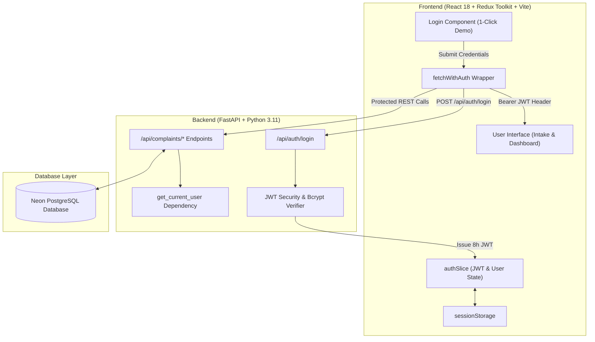
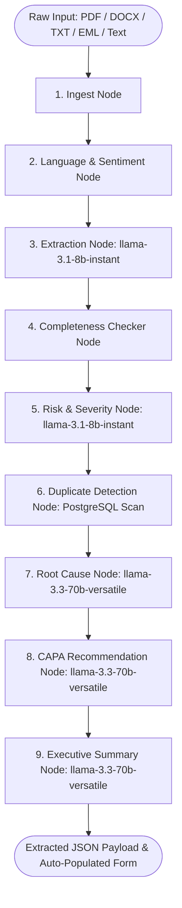
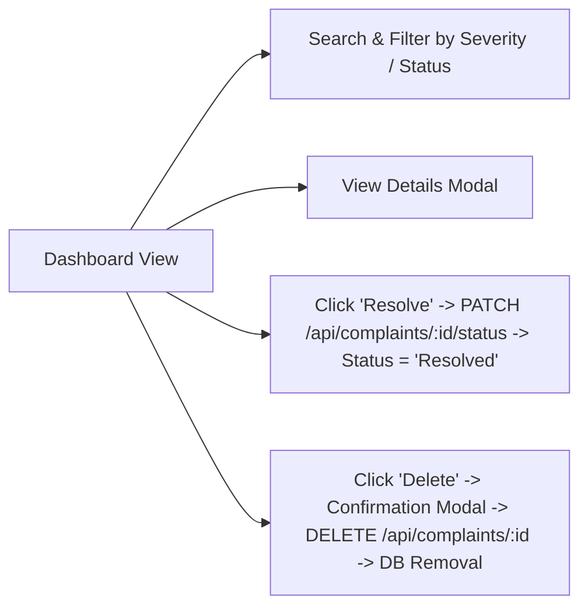

# 🛡️ AI-Powered Customer Complaint Management System (Pharma QMS)

[](https://github.com/sabatsambit49-dot/AI-Powered-Customer-Complaint-Management-System-/actions)
[](https://opensource.org/licenses/MIT)

> 🔗 **Live Demo Links**
> - 🌐 **Frontend App (Vercel)**: **[https://ai-powered-customer-complaint-manag-seven.vercel.app/](https://ai-powered-customer-complaint-manag-seven.vercel.app/)**
> - ⚡ **Backend API Docs (Render)**: **[https://ai-powered-customer-complaint-management-mnvp.onrender.com/docs](https://ai-powered-customer-complaint-management-mnvp.onrender.com/docs)**
> - 🏥 **API Health Check**: `https://ai-powered-customer-complaint-management-mnvp.onrender.com/api/health`
>
> 🔑 **Demo Login Accounts (Pre-Seeded for Video & Portfolio Evaluation)**
> - **QA Reviewer**: Username: `qa_reviewer` | Password: `pharma_demo_reviewer_123` *(Elena Rostova, QA Lead Reviewer)*
> - **QA Manager**: Username: `qa_manager` | Password: `pharma_demo_manager_123` *(Marcus Vance, QA Systems Manager)*
>
> *(Note: The login screen also features 1-click login buttons for instant demo access during evaluation.)*

---

## 1. Project Overview & Problem Statement

In pharmaceutical manufacturing—spanning both Active Pharmaceutical Ingredients (API) and Finished Dosage Forms (FDF)—customer complaints serve as critical signals of potential quality deviations, batch sterility breaches, container closure integrity failures, or labeling errors. Regulatory authorities (FDA 21 CFR Part 211.198, EU GMP Chapter 8) mandate rigorous intake, investigation, root cause analysis, and Corrective and Preventive Action (CAPA) tracking for every quality event.

Traditional complaint intake relies on manual data entry from emails, PDFs, or physical incident forms. This creates bottlenecking, inconsistent severity classification, delayed risk escalation, and missed duplicate reports across manufacturing lots.

The **AI-Powered Customer Complaint Management System** automates this end-to-end workflow:
1. **Gated Auth Access**: Enforces JWT employee authentication with bcrypt password verification and role-based demo profiles.
2. **Dual-Panel UI**: Features a structured "Log Customer Complaint" form on the left and an "AI Complaint Intake Assistant" widget on the right.
3. **Multi-Node LangGraph State Graph**: Processes unstructured complaint documents (PDF, DOCX, TXT, EML) or raw text, extracting 12 structured pharma fields into the form in real time using Groq LLM JSON mode (`llama-3.1-8b-instant`).
4. **Risk Triage & Duplicate Scanning**: Performs cGMP severity classification (Critical, Major, Minor), calculates completeness score (0-100%), flags missing fields, and queries PostgreSQL/Neon DB for recurring lot defects.
5. **Root Cause & CAPA Generation**: Uses reasoning LLMs (`llama-3.3-70b-versatile`) to formulate preliminary root causes and 3-step CAPA recommendations.
6. **Complaints Dashboard**: Provides full CRUD management with status resolution, search, severity/status filters, and delete confirmation dialogs.

---

## 2. Comprehensive Feature List

- 🔒 **Employee JWT Authentication**: Gated login system with bcrypt password hashing, 8-hour JWT token expiration, and `sessionStorage` session persistence.
- 📄 **Multi-Format Document Ingestion**: Parses PDF (`pypdf`), DOCX (`python-docx`), TXT, and EML email files with automatic attachment and header extraction.
- ⚡ **9-Node LangGraph Pipeline**: Automated sequential state graph running language detection, translation, field extraction, completeness scoring, risk triage, duplicate lot scanning, root cause analysis, CAPA drafting, and summary generation.
- 🎯 **Strict JSON Schema Extraction**: Employs Groq `llama-3.1-8b-instant` in JSON mode (`response_format={"type": "json_object"}`) with Pydantic validation to guarantee clean field extraction without model prose drift.
- ⚠️ **cGMP Risk Triage & Regulatory Flags**: Classifies complaint severity (Critical, Major, Minor) and flags regulatory escalation requirements (e.g. Field Alert Report / FAR) based on FDA/EU GMP rules.
- 🔎 **Automated Duplicate Lot Detection**: Queries PostgreSQL for prior complaints matching the same batch/lot number or product name to detect systemic manufacturing line deviations.
- 💡 **AI Explainability Modal**: Interactive breakdown showing exact risk scoring criteria, mandatory completeness rules, and duplicate matching algorithms.
- 💬 **Interactive QA Chat Assistant**: Real-time contextual chat allowing QA reviewers to ask clarifying questions or draft customer responses based on complaint data.
- 📊 **Complaints Dashboard**: Complete management view with multi-attribute search, severity filter, status filter, detail inspection, status resolution (`"Resolved"`), and modal delete confirmation.

---

## 3. Architecture & Workflow Diagrams

### System & Authentication Architecture



---

### LangGraph 9-Node State Graph Pipeline



---

### Complaints Dashboard Management Flow



---

## 4. Multi-Node LangGraph State Graph Explanation

1. **Ingest Node**: Extracts raw plain-text from uploaded document files (PDF via `pypdf`, DOCX via `python-docx`, EML via standard Python `email` library) or text paste.
2. **Language & Sentiment Node**: Detects input language, translates non-English complaints to English, and evaluates sentiment/urgency.
3. **Extraction Node (`llama-3.1-8b-instant`)**: Extracts 12 structured fields into JSON format using Groq's structured JSON mode and Pydantic validation.
4. **Completeness Checker Node**: Evaluates mandatory fields (Product Name, Batch Number, Customer, Defect Type, Description), calculates a 0-100% score, and generates clarifying questions for missing items.
5. **Risk & Severity Classification Node (`llama-3.1-8b-instant`)**: Evaluates cGMP risk rules to assign severity (`Critical`, `Major`, `Minor`), priority (`High`, `Medium`, `Low`), and regulatory escalation flags (e.g., FAR).
6. **Duplicate Detection Node**: Queries PostgreSQL database for existing complaints matching the same batch/lot number to flag recurring lot issues.
7. **Root Cause Recommendation Node (`llama-3.3-70b-versatile`)**: Recommends probable cGMP root cause categories (e.g. Raw Material Sub-potency, Packaging Line Error, Cold Chain Excursion) with technical justification.
8. **CAPA Recommendation Node (`llama-3.3-70b-versatile`)**: Formulates a structured 3-step CAPA plan (Immediate Action, Corrective Action, Preventive Action).
9. **Executive Summary Node (`llama-3.3-70b-versatile`)**: Drafts a 2-sentence executive summary for QA leadership reviews.

---

## 5. Tech Stack

- **Frontend**: React 18, Redux Toolkit 2.2, Vite 5, Tailwind CSS 3.4, Lucide React Icons.
- **Backend**: Python 3.11, FastAPI 0.110, Uvicorn, Pydantic v2, SSE-Starlette.
- **AI Agent Orchestration**: LangGraph 0.0.30, LangChain Core.
- **LLM Provider**: Groq API (`llama-3.1-8b-instant` for fast extraction & classification; `llama-3.3-70b-versatile` for root cause, CAPA, & summary).
- **Authentication**: PyJWT (JWT tokens with 8h expiry), Bcrypt password hashing.
- **Database & ORM**: PostgreSQL 15 / Neon Serverless Postgres, SQLAlchemy 2.0.
- **Document Parsing**: `pypdf`, `python-docx`, Python `email` package.
- **DevOps**: Docker, Docker Compose, GitHub Actions CI/CD.

---

## 6. API Reference

All `/api/complaints/*` endpoints require authentication via header: `Authorization: Bearer <access_token>`.

### Authentication Endpoints

#### `POST /api/auth/login`
- **Description**: Authenticates employee credentials and returns JWT token.
- **Request Body**:
  ```json
  {
    "username": "qa_reviewer",
    "password": "pharma_demo_reviewer_123"
  }
  ```
- **Response (`200 OK`)**:
  ```json
  {
    "access_token": "eyJhbGciOiJIUzI1Ni...",
    "token_type": "bearer",
    "username": "qa_reviewer",
    "full_name": "Elena Rostova",
    "role": "QA Lead Reviewer"
  }
  ```

#### `GET /api/auth/me`
- **Description**: Returns profile info for the currently authenticated employee.

---

### Complaint Endpoints

#### `POST /api/complaints/extract`
- **Description**: Ingests raw text or document upload and executes the 9-node LangGraph pipeline.
- **Form Data**: `raw_text` (string) OR `file` (UploadFile).

#### `POST /api/complaints`
- **Description**: Saves a structured complaint record to the PostgreSQL database.
- **Request Body**: `ComplaintCreate` JSON object.

#### `GET /api/complaints`
- **Description**: Fetches saved complaints with optional query filters (`severity`, `status`, `search`).

#### `GET /api/complaints/{id}`
- **Description**: Fetches single complaint details by ID.

#### `PATCH /api/complaints/{id}/status`
- **Description**: Updates complaint status without deleting the record.
- **Request Body**: `{"status": "Resolved"}`

#### `DELETE /api/complaints/{id}`
- **Description**: Permanently deletes a complaint record and its associated chat history.

#### `POST /api/complaints/chat-draft`
- **Description**: Contextual AI assistant chat for unsaved draft complaints.

#### `POST /api/complaints/{id}/chat`
- **Description**: Interactive AI assistant chat for saved database complaints.

---

## 7. Local Setup & Installation

### Prerequisites
- Python 3.11+
- Node.js 18+
- Groq API Key ([console.groq.com](https://console.groq.com))

### Backend Setup
1. Navigate to backend directory:
   ```bash
   cd backend
   ```
2. Create and activate a virtual environment:
   ```bash
   python -m venv venv
   # On Windows:
   .\venv\Scripts\activate
   # On macOS/Linux:
   source venv/bin/activate
   ```
3. Install dependencies:
   ```bash
   pip install -r requirements.txt
   ```
4. Configure `.env` file in `backend/.env`:
   ```ini
   GROQ_API_KEY=your_groq_api_key_here
   PRIMARY_MODEL=llama-3.1-8b-instant
   REASONING_MODEL=llama-3.3-70b-versatile
   DATABASE_URL=sqlite:///./pharma_complaints.db
   HOST=0.0.0.0
   PORT=8000
   ENVIRONMENT=development
   JWT_SECRET_KEY=pharma_qms_super_secret_jwt_key_2026_demo
   JWT_ALGORITHM=HS256
   ACCESS_TOKEN_EXPIRE_HOURS=8
   CORS_ORIGINS=http://localhost:5173,http://localhost:3000,http://127.0.0.1:5173
   ```
5. Run backend server:
   ```bash
   uvicorn app.main:app --reload --port 8000
   ```

### Frontend Setup
1. Navigate to frontend directory:
   ```bash
   cd frontend
   ```
2. Install dependencies:
   ```bash
   npm install
   ```
3. Create `.env` file in `frontend/.env`:
   ```ini
   VITE_API_BASE_URL=http://localhost:8000
   ```
4. Start local development server:
   ```bash
   npm run dev
   ```
5. Open browser at `http://localhost:5173` and log in using demo credentials!

---

## 8. Known Limitations

1. **`sessionStorage` Tab Isolation**: JWT tokens are stored in `sessionStorage` for browser tab isolation. Opening a new tab will prompt a fresh login.
2. **Render Cold Starts**: Render's free tier spins down inactive web instances after 15 minutes of inactivity. Initial requests may take 30-40 seconds to awaken.
3. **Duplicate Scanning**: Duplicate lot matching performs case-insensitive substring matching on batch numbers and product names.
